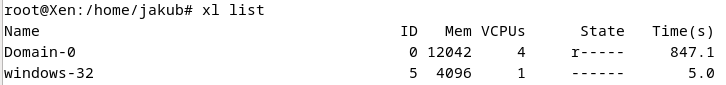
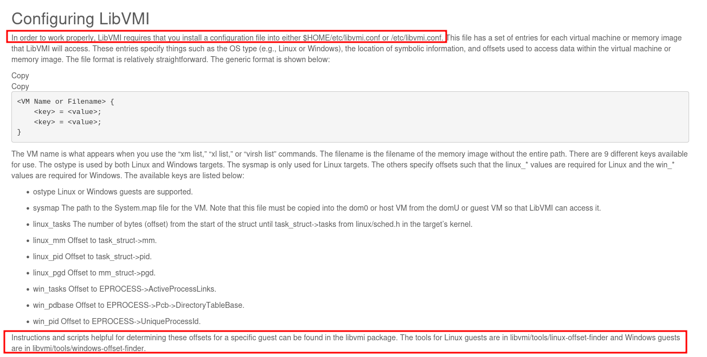
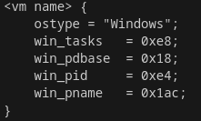

## Zapnutie VM-ky + mountnutie HDD
Pouzivam 32-bitovu VM-ku, kt. sa nachadza v /home/jakub/windows32.cfg
- ide o konfiguracny subor, kt. definuje XEN virtualny stroj a v kt. su nastavene vsetky potrebne parametre pre spustenie VMky, ako logical volume, volume group, cesta k windows ISO subore a pod.
    - volume groupa sa nachadza na SSD, konkretne v /dev/sda4, vid. **pvdisplay**
    - ide o HVM virtualizaciu

- kedze windows iso sa nachadza na HDD, tak je potrebne najskor ho mountnut pomocou **mount /dev/sdb1 /mnt/HDD/**
- nasledne pomocou **xl create windows32.cfg** sa spusti 32-bitovy windows stroj
- pomocou **xl list** si ho mozem vylistovat
- 
- nasledne sa pomocou **VNCviewer** pripojim

## Windows (debug symbols)offset finder
- Zdroje: 
    - https://github.com/libvmi/libvmi/tree/master/tools/windows-offset-finder
    - https://libvmi.com/docs/gcode-install.html

### 1. Ako prve treba urobit memory dump:
- ./vmi-dump-memory windows-32 /mnt/HDD/win32mem_dump_10_09_2024

### 2. Dalej treba ziskat debug symboly:
1. v libvmi/tools/windows-offset-finder sa nachadza getGUID.cpp a korespondujuce exe getGUID(ak nie, treba skompilovat)

2. nasledne treba zavolat **getGUID** s vytvorenym memory imagom:
    - **./getGUID /mnt/HDD/win32mem_dump_10_09_2024**
    - vystup:

        OS version unknown or not Windows
        
        guid: e1f980f84a04098e285b350c1fe1921e1
        
        filename: ntkrpamp.pdb
    - Z wiki: **This program searches through the memory image for the Windows kernel and uses known information about Windows operating system memory layout to obtain the OS's GUID and .pdb filename from the memory dump.**
    - vysledok mi poskyt
    - kedze subory boli naposledy editovane pred siedmimi rokmi, tak "OS version unknown or not Windows" je v poriadku
    - vyriesil som to jednoduchym fixom, kde som dal do switchu dalsi statement
    - tak isto bolo treba trochu upravit curl command

3. Nasledne dam vysledok do stdout a pipnem do **downloadPDB.py**, ktory stiahne potrebne debug symboly z Microsoft Symbol Serveru
    - **./getGUID /mnt/HDD/Xen_dumps/windows-32.dmp | ./downloadPDB.py**

    - Z wiki: **A Python script that runs from the command line with piped input from getGUID. It will access the Microsoft Symbol Server and download the .pdb file associated with the GUID and filename.**

4. Vysledok z downloadPDB.py opat pipnem, ale tento krat do **dumpPDB.py**, ktory symboly rozparsuje a ulozi do suboru 
    - Z wiki: **Input can be either piped or given as a .pdb file with the -f option. The -o flag must be supplied with an output filename in both cases.**
        - ./dumpPDB.py -f ntkrpamp.pdb -o symbols.txt 

5. Ako posledny krok prebehnem rozparsovane subory cez **createConfig.py**, kt. vybuilduje **libvmi.conf** subor, kt. je potrebny pre pouzivanie libvmi 
    - /createConfig.py -f symbols.txt
    -  